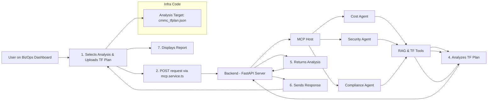

## 1. High-Level Agent Architecture

**Agents** are built around three core components:

1. **Environment**
2. **Tools** (with action↔feedback interface)
3. **System Prompt** (defines goals, constraints, behaviour)

**Runtime loop (pseudo-code):**

```python
env   = Environment()
tools = Tools(env)
prompt = "Goals, Constraints, and how to act"

while True:
    # LLM decides on an action given the prompt + current state
    action = llm.run(prompt + env.state)
    # Tools execute that action in the environment
    env.state = tools.run(action)
    if action == "<STOP>":
        break
```

---

## 2. Components

### 2.1 Environment

* Encapsulates the “world” the agent sees
* **Context examples:**

  * Screen resolution (e.g. 1024×768)
  * Available files, installed packages
  * Current working directory, shell prompts

### 2.2 Tools

Each tool exposes a small interface for the agent to interact with the env:

| Tool                                                 | Capabilities                          |
| ---------------------------------------------------- | ------------------------------------- |
| **Terminal**                                         | `bash`, `grep`, `read`, `write`       |
| **OS UI**                                            | `click`, `type`, `screencast`         |
| **Search**                                           | `search-web`, `search-local`, `fetch` |
| **Calculator**, **Calendar**, **CodeInterpreter**, … | …                                     |

### 2.3 System Prompt

* **Defines:**

  * Agent identity (“You are a coding assistant…”)
  * **Goals** & **Constraints**
  * **Tool list** (with usage examples)
  * **History** of past actions & results

---

## 3. Agent Examples

| **Env**     | **Tools**                          | **System Prompt**                                |
| ----------- | ---------------------------------- | ------------------------------------------------ |
| `Ubuntu VM` | Terminal, CodeInterpreter, Search  | “You are an interactive coding agent on Ubuntu…” |
| `Browser`   | SearchBar, Click, Type, Screenshot | “You are a search assistant in Chrome…”          |

---

## 4. Recommended Actions & Limitations

* **Recommended:**

  * “You can and should install apps via Terminal…”
* **Limitations:**

  * Cannot solve reCAPTCHA
  * Tools & LLM integration still experimental
  * Agents need **budget awareness** (API cost caps)
  * Tools should be **self-evolving**
  * **Multi-agent** communication patterns TBD

---

## 5. Agent “Model” Diagram

```
       +---------------------+
       |   Long-Term Memory  |
       +---------------------+
                 ^
                 |
+---------+    Planning    +----------+    +-------------+
| Calendar|--------------->|  Agent   |--->|  Reflection |
+---------+                 +----------+    +-------------+
|Calculator|                 |   ^   |
+---------+                  |   |   v
| … tools  |<––Tools– – – – –+ Action +––> Self-Critics / Chain-of-Thought
+---------+                             Subgoal Decomp.
```

---

## 6. MCP Protocol (Host ↔ Clients)

1. **MCP Host / Clients** communicate via a lightweight protocol.
2. **MCP Server** exposes:

   * Tools & Resources
   * Prompt Templates
   * Memory/History store

```
[MCP Server API] ──> Service 1
                 └──> Service 2
                 └──> Service 3
```

---

## 7. Types of Agents

| Agent Type             | Behavior Basis                       |
| ---------------------- | ------------------------------------ |
| **Simple Reflex**      | Current env only (Stimulus→Response) |
| **Model-Based Reflex** | Env + internal state (Remembers)     |
| **Goal-Based**         | Predictions + Goals                  |
| **Utility-Based**      | Maximizes a utility function         |
| **Learning**           | Improves from past experience        |

---

## 8. “Crazy” MCP Dev Environment

A rough shell-script flow you sketched for spinning up/testing:

```bash
uv init employee
cd employee
uv venv

# add your MCP control tool
uv add 'mcpctl' requests

# scaffold a survey tool
touch survey.py

# test the tool in dev mode
uv run mcp dev survey

# (typo?) wnksnlim —> ? 
```

---

### How to Plug into Your RAG-LLM App

1. **Wrap your RAG retrieval chain** as a “Tool” in the above framework.
2. **Extend the System Prompt** with your RAG app’s goals (e.g. “assist with document Q\&A…”).
3. **Define an “Invoke Retrieval” action** so the agent can call the RAG chain at runtime.


## Multi-Agent MCP (Model–Chain–Protocol) Architecture

### 1. Overview

The MCP multi-agent pattern leverages a central **MCP Host/Server** and multiple **Agent Clients**. Each agent encapsulates:

1. **Environment (Env)** – the world state and context
2. **Tools** – discrete, callable APIs for interacting with the environment or external systems
3. **System Prompt + Memory** – identity, goals, constraints, and past interactions

Agents operate concurrently or collaboratively under a lightweight MCP protocol that coordinates communication, state sharing, and resource access.

---

### 2. Core Components

#### 2.1 Environment

* Represents local context (e.g., terminal session, VM state, browser DOM)
* Exposes properties: file system, screen resolution, installed software, network status

#### 2.2 Tools

* Well-defined interfaces wrapping functionality for the agent:

  * **Terminal Tool**: `run_shell(cmd)`, returns stdout/stderr
  * **File Tool**: `read(path)`, `write(path, contents)`
  * **Search Tool**: `search_web(query)`, `search_local(query)`
  * **Executor Tools**: `run_code(snippet)`, `calculate(expression)`
  * **UI Tool**: `click(selector)`, `type(selector, text)`, `screenshot()`

Each tool returns structured results that the agent ingests into its memory.

#### 2.3 System Prompt & Memory

* **System Prompt** defines:

  * Agent identity (e.g., "You are a coding assistant on Ubuntu 22.04")
  * **Goals** (high‑level tasks)
  * **Constraints** (time, resource, security, cost budgets)
  * **Available tools** with usage examples
* **Memory**:

  * **Short‑Term**: recent action–observation pairs
  * **Long‑Term**: persistent knowledge, learned patterns, user preferences

---

### 3. Agent Control Loop (Pseudo‑Code)

```python
# Initialization
env         = Environment()
tools       = Toolset(env)
memory      = Memory()
sys_prompt  = load_system_prompt()

while True:
    # Combine prompt, memory, and current env state
    context = sys_prompt + memory.retrieve_recent() + env.describe()

    # LLM proposes an action
    action  = llm.generate_action(context)

    if action.type == 'STOP':
        break

    # Execute via appropriate tool
    result  = tools.dispatch(action)

    # Store observation
    memory.append(action, result)

    # (Optional) Self‑reflection or planning step
    if should_reflect(memory):
        reflection = llm.reflect(memory)
        memory.store_long_term(reflection)
```

---

### 4. MCP Protocol

* **MCP Host (Server)**:

  * Maintains global memory store, routing, and authentication
  * Serves tool definitions and prompt templates to agents
* **Agent Clients**:

  * Register with host, fetch configuration
  * Send action logs and receive cross-agent messages

```

[MCP Host API]
   ├─ /register
   ├─ /get_tools
   ├─ /get_prompt
   └─ /post_events
```

---

### 5. Agent Taxonomy

| Type                | Decision Basis                      |
| ------------------- | ----------------------------------- |
| **Simple Reflex**   | Observations → Actions              |
| **Model‑Based**     | Observations + Internal State       |
| **Goal‑Based**      | State + Goal planning (search)      |
| **Utility‑Based**   | Maximizes utility function          |
| **Learning Agents** | Updates model from feedback/rewards |

---

### 6. Development & Testing

**Example Shell Workflow:**

```bash
# Scaffold agent environment
git clone repo && cd repo
python -m venv venv
source venv/bin/activate

# Install and register tools
pip install -r requirements.txt
mcpctl register --name agent1

# Start development server
env MCP_ENV=dev mcpctl serve

# Run agent simulation
env MCP_ENV=dev python agent_main.py
```

---

### 7. Integration with RAG‑LLM Apps

1. **Embed Retrieval** as a Tool:

   ```python
   class RetrievalTool(Tool):
       def invoke(self, query):
           docs = rag_chain.retrieve(query)
           return docs
   ```

2. **Extend System Prompt** with RAG defaults (e.g., retrieval budget, citation style).
3. **Action Schema**: define `RETRIEVE`, `SUMMARIZE`, `ANSWER` actions that call RAG.
4. **Reflect & Learn**: store good Q\&A pairs into long‑term memory for improved future responses.


## 1. ChatGPT Enterprise Pricing (Google Search Snippet)

> \*\*ChatGPT Enterprise pricing is not a fixed cost, but rather a customized, contract-based solution. It typically starts around **\$60 per user per month**, with a minimum contract length of 12 months and a minimum of 150 seats. The exact cost can vary significantly based on company size, usage, and negotiated terms with OpenAI’s sales team.
> *Pricing is determined through direct consultation with OpenAI’s sales team and is not publicly published.*

---

## 2. Ollama AI Models & Local Stack Diagram

### Ollama AI Models (UI Tabs)

* **Embedding**

  * `onnx-embed-text`
* **Vision**

  * `gemma3` (current, most capable single-GPU model)
  * `llama2-unconstrained`
* **Tools**

  * …
* **Thinking**

  * `qwen3` (dense & mixture-of-experts)
  * `qwen2.5-coder` (code generation & reasoning)

---

### Local Agent Stack

```plain
┌────────────────────────────┐
│   MacBook / Windows OS    │
└─────────────┬──────────────┘
              │
      ┌───────▼─────────┐
      │  Docker Engine  │   ← Package host software into containers
      └───────┬─────────┘
              │
┌─────────────▼─────────────┐
│  Orchestration & Access   │
│  - OpenWebUI (Chat UI)    │
│  - n8n Automation         │
│  - VPN (Private Connect)  │
│  - Phone (Remote Access)  │
└─────────────┬─────────────┘
              │
      ┌───────▼─────────┐
      │   AI Agents     │   ← memory & MCP server tool-calling
      └─────────────────┘
```

* **Memory Layer**
* **MCP Server Tool Calling**
* **System Prompts & Instructions**
* **Documents / RAG Database**

---

## 3. BizOps Dashboard – Multi-Agent MCP Workflow



1. **Select & Upload** Terraform plan JSON (`infra/terraform code` → `cmmc_tfplan.json`)
2. **POST** to FastAPI via `mcp.service.ts` in Angular frontend
3. **MCP Host** activates three specialist agents:

   * **Cost Agent**
   * **Security Agent**
   * **Compliance Agent**
4. Each agent uses **RAG & Terraform Tools** to analyze the plan JSON
5. **Compliance Agent** (for example) returns its analysis to FastAPI
6. **Backend** aggregates and sends the response back to the frontend
7. **Angular App** renders the detailed compliance/cost/security report

---

Below is a breakdown of the Ollama “local stack” diagram, mapped point-for-point to your Coldchain Secure / BizOps RAG-LLM project:

---

## 1. Host OS Layer

**Diagram:** `MacBook / Windows`
**In Your Project:**

* Your developer machine (laptop or workstation) running macOS, Windows, or Linux.
* Hosts:

  * **Angular BizOps Dashboard** (frontend development)
  * **FastAPI server** (backend development)
  * **Terraform CLI** when you generate plan JSON

---

## 2. Containerization Layer

**Diagram:** `Docker Engine` (“Host Software into Packages”)
**In Your Project:**

* **Docker Compose** setup for:

  * FastAPI backend
  * RAG indexer (e.g. vector database container)
  * MCP Host service
  * Agent sandboxes (Cost-Agent, Security-Agent, Compliance-Agent)
* Ensures each service (RAG retrieval, MCP server, Angular dev server) runs isolated but networked.

---

## 3. Orchestration & Access

```plain
   ┌───────────┐    ┌─────────────┐    ┌───────────┐
   │ OpenWebUI │    │    n8n      │    │   VPN     │
   │ (Chat UI) │    │ (Automation)│    │(Private)  │
   └───────────┘    └─────────────┘    └───────────┘
       ↓                 ↓                 ↓
   ┌────────────────────────────────────────────────┐
           AI Agents (MCP Clients & RAG Tools)
   └────────────────────────────────────────────────┘
```

1. **OpenWebUI (Chat Interface)**

   * In your project this is the **Angular BizOps Dashboard** which provides:

     * File upload (Terraform JSON)
     * Chat-style view of the analysis results
     * “Run Analysis” button → triggers MCP workflow

2. **n8n (Automation Engine)**

   * Represents your **MCP Host orchestrator** or any workflow engine you use:

     * Chains together “Receive upload → POST to FastAPI → dispatch to MCP Host → fan-out to agents → collect responses → return to frontend.”
     * Can also automate nightly “fresh RAG index rebuilds” or scheduled health checks.

3. **VPN / Private Connect**

   * Your secure network link from the BizOps Dashboard to backend services:

     * If you host your RAG vector store or Terraform state in a private VPC or on-prem datacenter, the VPN tunnel ensures secure R/W.
     * Aligns with your requirement for **Azure private endpoints** or AWS **VPC-only** access.

---

## 4. Remote Access

**Diagram:** `Phone (📱) remote access`
**In Your Project:**

* Mobile-friendly view of the BizOps Dashboard, or remote SSH into your MCP/agent containers.
* Useful when you need to trigger a compliance scan or review a Terraform report on-the-go.

---

## 5. AI Agents Layer

```plain
┌────────────────────────────────────────────────┐
│  AI Agents                                    │
│  • Cost Agent                                 │
│  • Security Agent                             │
│  • Compliance Agent                           │
│      ↳ each calls your RAG & Terraform tools   │
│  • (future: Architecture Agent, Networking…)  │
└────────────────────────────────────────────────┘
```

* **Memory Layer**:

  * Short-term (conversation history) + long-term (past plan analyses, user preferences).
* **MCP Server Tool Calling**:

  * The MCP Host serves tool definitions (e.g. `analyze_tf_plan()`, `retrieve_docs()`).
* **System Prompts & Instructions**:

  * Boot-up prompts that define agent roles (“You are the Cost Agent. Your goal is to estimate monthly AWS costs from this TF plan.”)
* **Documents / RAG Database**:

  * Your vector store of compliance standards, Terraform docs, CMMC guidelines, etc.

---

### How It All Fits Together

1. **Developer Machine (OS)**
   → spins up →
2. **Docker Containers**

   * FastAPI, MCP Host, RAG index, agents
3. **n8n / MCP Host**

   * Orchestrates agent workflows when user uploads a TF plan
4. **OpenWebUI (Angular)**

   * Frontend chat interface triggers analyses and displays results
5. **VPN**

   * Secures connectivity to private data stores (Vector DB, Terraform remote state)
6. **AI Agents**

   * Each agent retrieves relevant docs from RAG, runs Terraform plan analysis tools, writes results back
7. **Phone / Remote**

   * You can access the same dashboard or SSH into containers remotely

---